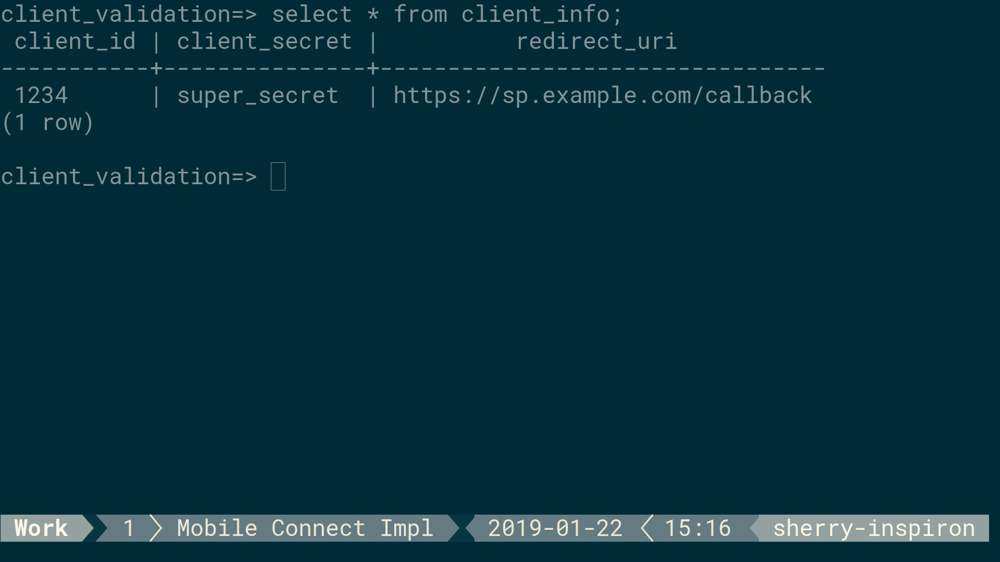
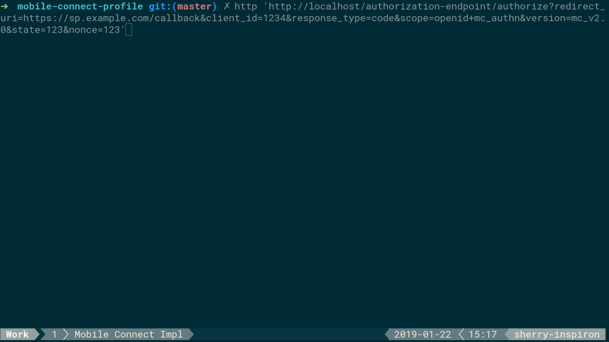
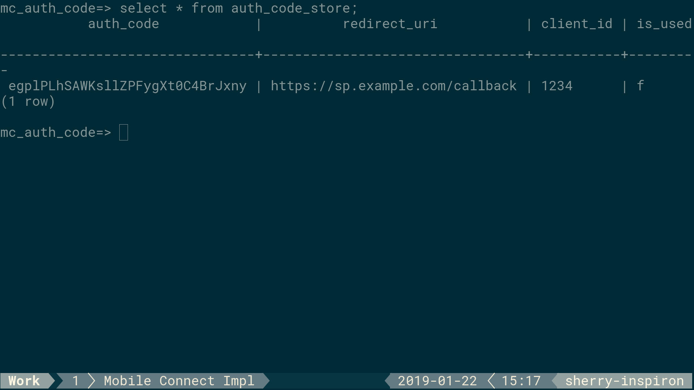
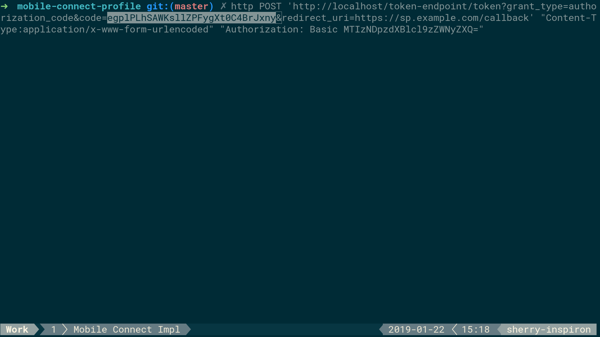
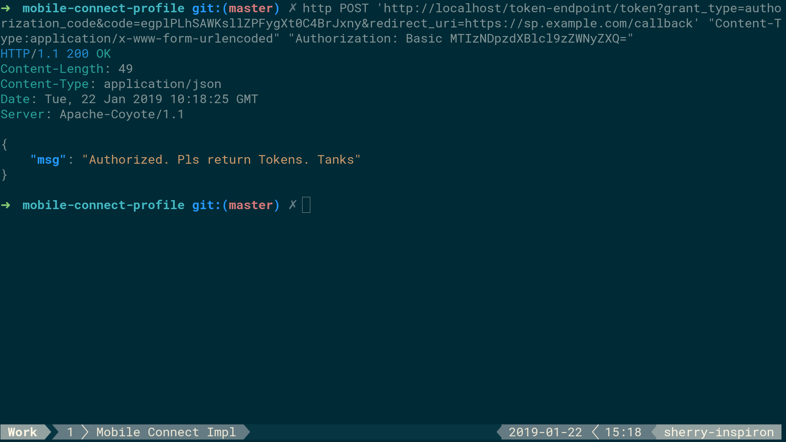
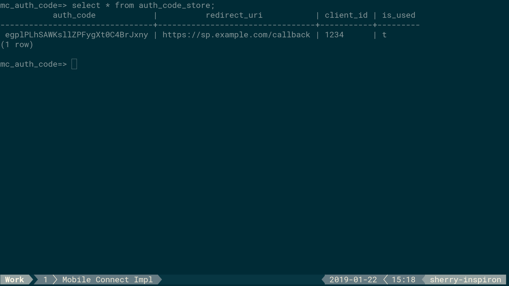

# User Guide

## Working

### Authentication Endpoint Working

#### Ensure Client is registered to database

This table will be used when validating Authorization Endpoint Request.

#### Send Valid Request

This is a valid request, having valid **client_id** and **redirect_uri**.

#### Response of Authentication Request

The response contains a Location header, having the redirect_uri and code as query parameter

#### Authorization Code Database

The code that is given to the client, is registered in the database. This can also be used for logging.

You can see there is a column called **is_used** which denotes if the code has been used by Token Endpoint.

#### Token Request

We now send a token request that has valid parameters, including the code we just got.

The Authorization Header contains the hash of **client_id:client_secret**, which is encoded using **Base64**.

#### Token Request Response

We get a successful token response. I have yet to implement Token Response. So this is the placeholder for now :D

#### Authorization Code Database

The Authorization Code in the database is now marked as true, which ensures the same code is not used again.
